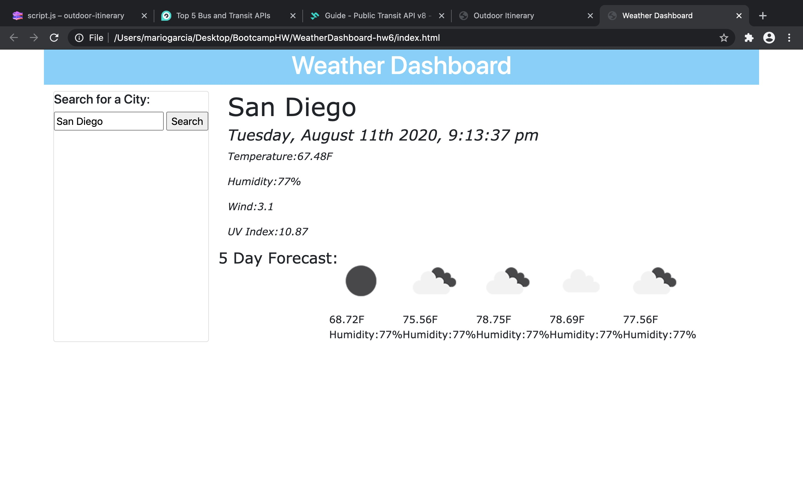

# WeatherDashboard-hw6
Server-Side APIs

## Repository Github Link:

https://github.com/analuna01/WeatherDashboard-hw6.git

## Deployed App. Link:

 https://analuna01.github.io/WeatherDashboard-hw6/

### Comments:
The goal for this project was to create a weather dashboard that included a search section where the user can look for a city and the current weather conditions would display along with a five day forecast. 
For this assignment we used APIs from "https://openweathermap.org/api" and the AJAX method to retrieve the weather information.

### Screenshot of Deployed App:

